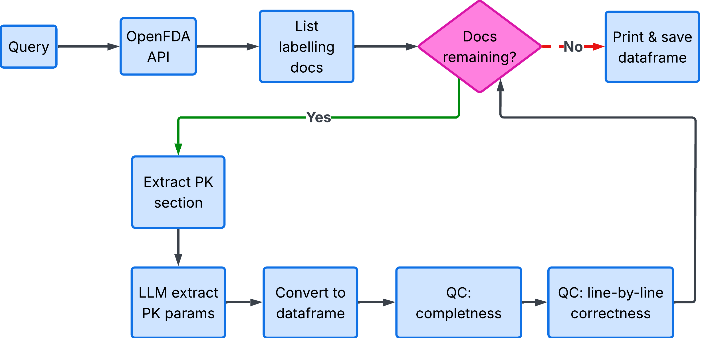
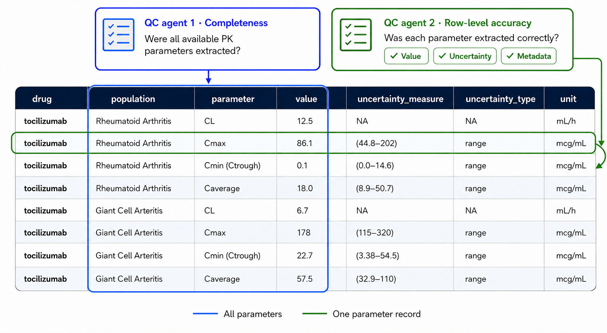
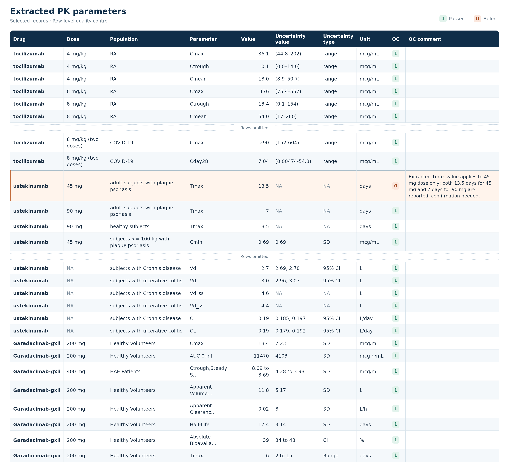

# Extracting PK Parameters from FDA Labeling Documents
## Introduction
This is a short tutorial that demonstrates utility of Large Language models (LLMs) in pharmcomatrics workflows. The tutorial focuses on PK parameters extraction from FDA labeling documents. Information extraction from unstructured text is often an early and time-consuming step in PMX model development. Here I will demonstrate how to automate this step with the help of LLM-based agentic workflow. 
PK parameter extraction workflow has the following key steps: 
- retrieval of relevant drug labels via OpenFDA API;
- LLM-based extraction of PK parameters;
- LLM-based quality control (QC):
  - completeness QC;
  - accuracy QC;

A flowchart for the workflow is shown below: 

Python is the most commonly used programming language for developing LLM-based applications/agents, whereas R is widely used  by pharmacometricians. LLMs can be called from Python via LiteLLM package (https://docs.litellm.ai/) and from R with the help of ellmer pacakge (https://ellmer.tidyverse.org/). Both Python (https://github.com/dzianismr/GetPKParameterOpenFDA/blob/main/OpenFDA_getPK_Python.ipynb) and R (https://github.com/dzianismr/GetPKParameterOpenFDA/blob/main/OpenFDA_getPK_R.ipynb) codes for LLM-based PK parameter extraction from FDA labelling documents are provided in this tutorial. 

To make the examples easily accessible and executable they are published as Google Colab notebooks. They could be executes directly in a web browser. Note, before running the notebooks, the OPENAI_API_KEY environment variable must be configured securely.

## Searching for and Retrieving Relevant Labels via OpenFDA API
The first step is to search for and retrieve relevant drug-labeling records using the openFDA Drug Label API. In this case we will retrieve three labeling documents which satisify the following creteria: is monoclonal antibody and includes "paediatric" in the PK section. Detaield API description is available at openFDA web page (https://open.fda.gov/). 

### R 
```r
drug_query <- "*mab+AND+pharmacokinetics:pediat*"
url <- paste0("https://api.fda.gov/drug/label.json?search=openfda.generic_name:", drug_query, "&limit=3")

req <- request(url) |> req_perform()
```

### Python
```python
n = 3
url = "https://api.fda.gov/drug/label.json?search=openfda.generic_name:*mab+AND+pharmacokinetics:pediat*&limit="+ str(n)

response = requests.get(url)
```

## Setting Up the Interface to LLM
The following code initializes the LLM interface. A system prompt defines the model’s role and expected output format. In this example, the system prompt is:  

"You an experienced pharmacokineticist with attention to the detail. You specialize in extracting PK parameters from the text. You always return results in JSON format."


### R
```r
  chat <- chat_openai(
    system_prompt = message_system,
    model = "gpt-4o",
     api_key = OPENAI_API_KEY,
    echo = "none"
  )
```

### Python
```python
def generate_response(messages: List[Dict]) -> str:
    """Call LLM to get response"""
    response = completion(
        model="openai/gpt-4o",
        messages=messages,
        max_tokens=4096
    )
    return response.choices[0].message.content
```

## Calling LLM to Extract PK Parameters
The user prompt is combined with the text from Pharmacokinetic section of the labelling document and submitted to LLM for PK parameter extraction. The user prompt is the following:

"The following text was extracted from FDA labelling document. Extract reported PK parameters e.g. CL, AUC, Cmin (Ctrough), Cmax also extract uncertainty of the estimate as well as units. Extracted parameters should be reported in tabular view. Table columns should include: drug, population, parameter, value, uncertainty_measure, uncertainty_type, unit."


### R
```r
 # create prompt by combining user instruction with the pk section
  updated_message_user = paste0( message_user, " ",  pk_text)

  # submit prompt and get response from the LLM
  raw_response <- chat$chat( updated_message_user )

```

### Python
```python
 # create prompt by combining user instruction with the pk section
        updated_message2 = message2.copy()
        updated_message2['content'] = updated_message2.get('content', '') + pk_text

        messages = [
            message1,
            updated_message2
        ]


        try:
            # submit prompt and get response from the LLM
            raw_response = generate_response(messages)
```
## Quality Overview
QC is implemented at two levels:
- verify that all available PK parameters were extracted;
- verify, parameter by parameter (or row by row), that its value, uncertainty, and metadata were extracted correctly;


## Quality Control, Completness 
The user prompt is constructed by combining selected columns with extracted parameters, pharmacokinetic section of the labelling document and user instructions. User instructions are the following:

"The following summary table in JSON format contains pharmacokinetic parameters and metadata extracted from the PK section of the FDA labelling document. Check if all PK parameters, for which numerical values are available in the FDA labelling document, specifically CL (clearance), Vd (volume of distribution), AUC (Caverage), Cmin (Ctrough), Cmax are present in the summary table. If an additional PK parameter is mentioned, however it's numerical value is not reported - ignore it. Response should include two and only two values COMPLETE and COMMENT. COMPLETE: is set to 1 if summary table is complete and to 0 if summary table is not complete. COMMENT: contains empty string if COMPLETE=1, if COMPLETE=0 COMMENT lists PK parameters missing in the summary table, specifically PK parameters, their values and population. Importantly, COMPLETE should be a single string."

### R
```r
  # Create QC completness prompt by combining user instruction with the pk section
  # and selected columns ("dose", "population", "parameter", "value")
  updated_message_user_QC2 <- paste0(
    message_user_QC2,
    " Extracted PK parameters in JSON format: ", ; selected columns
    json_pk1_str,
    " PK Section of the labelling document: ",
    pk_text
  )

  # Submit prompt and get response from the LLM
  raw_response_QC <- chat_QC$chat(updated_message_user_QC2)
```

### Python
QC agent is not yet implemented in Python.

## Quality Control, Accuracy 
The user prompt is constructed by combining extracted table row corresponding to a single PK parameter with pharmacokinetic section of the labelling document and user instructions. User instructions are the following:

"The following pharmacokinetic parameter and metadata were extracted from the PK section of the FDA labelling document. Perform quality control of the extracted PK parameter. Specifically, confirm numerical accuracy of the extracted PK parameter, its uncertainty and metadata describing unit of the parameter value, dose and population it was extracted from. Response should include two and only two values: QC: 1 = passed, 0 = failed. QC_comment: empty string if QC=1, a short description of identified error if QC=0."

### R
```r
  # Create QC accuracy prompt by combining user instruction with the pk section of the labelling documet
  # and single row containing extracted PK parameter
  updated_message_user_QC <- paste0(
    message_user_QC,
    ". Extracted PK parameters in JSON format: ", ; single row
    json_pk1_str,
    ". PK Section of the labelling document: ",
    pk_text
  )

  # Submit prompt and get response from the LLM
  raw_response_QC <- chat_QC$chat(updated_message_user_QC)
```

### Python
QC agent is not yet implemented in Python.

## Wrapping Things Up
In the complete workflow, the extraction step is repeated for each of the n retrieved labeling records. The JSON responses are parsed and combined into a single data frame containing the PK parameters extracted from all processed records.
The final outout should look something like Table belowL:  

## Disclaimer
The views expressed in this tutorial are solely those of the author and do not necessarily reflect the views of the author’s employer.  

R and Python codes as well as tutotial text were produced with the assistance of LLMs. The author reviewed and edited the final content.

## License

[MIT](LICENSE)
