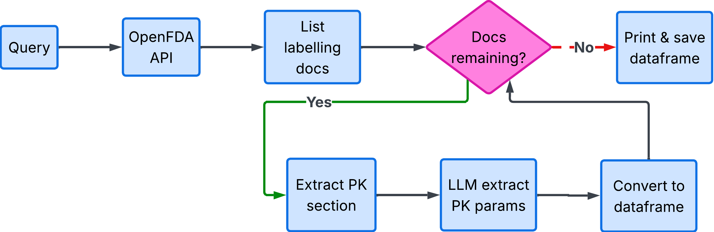
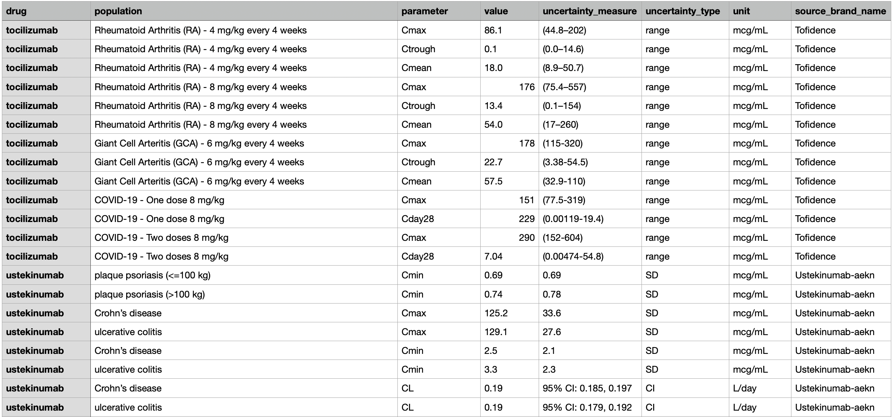

# Extracting PK Parameters from FDA Labeling Documents
## Introduction
This is a short tutorial that demonstrates utility of Large Language models (LLMs) in pharmcomatrics workflows. The tutorial focuses on PK parameters extraction from FDA labeling documents. Information extraction from unstructured text is often an earlier and time-consuming step in PMX model development. Here I will demonstrate how to automate this step with the help of AI agent. 
PK parameter extraction workflow has two key steps: 
- retrieval of relevant drug labels via OpenFDA API;
- LLM-based extraction of PK parameters;  
 A flowchart for the workflow is shown below: 

 Python is the most commonly used programming language for developing LLM-based applications/agents, whereas R is widely used  by pharmacometricians. LLMs can be called from Python via LiteLLM package (https://docs.litellm.ai/) and from R with the help of ellmer pacakge (https://ellmer.tidyverse.org/). Both Python (https://github.com/dzianismr/GetPKOpenFDA/blob/main/OpenFDA_getPK_Python.ipynb) and R (https://github.com/dzianismr/GetPKOpenFDA/blob/main/OpenFDA_getPK_R.ipynb) codes for LLM-based PK parameter extraction from FDA labelling docuemnts are provided in this tutorial. 

 To make the examples easily accessible and executable they are published as Google Colab notebooks. They could be executes directly in a web browser. Note, before running the notebooks, the OPENAI_API_KEY environment variable must be configured securely.

## Searching for and Retrieving Relevant Labels via OpenFDA API
The first step is to search for and retrieve relevant drug-labeling records using the openFDA Drug Label API. In this case we will retrieve three labeling documents which satisify the following creteria: is monoclonal antibody and includes "paediatric" in the PK section. Detaield API description is available at openFDA web page (https://open.fda.gov/). 

### R 
```r
drug_query <- "*mab+AND+pharmacokinetics:pediat*"
url <- paste0("https://api.fda.gov/drug/label.json?search=openfda.generic_name:", drug_query, "&limit=3")

req <- request(url) |> req_perform()
```

### Python
```python
n = 3
url = "https://api.fda.gov/drug/label.json?search=openfda.generic_name:*mab+AND+pharmacokinetics:pediat*&limit="+ str(n)

response = requests.get(url)
```

## Setting Up the Interface to LLM
The following code initializes the LLM interface. A system prompt defines the model’s role and expected output format. In this example, the system prompt is:  
"You an experienced pharmacokineticist with attention to the detail. You specialize in extracting PK parameters from the text. You always return results in JSON format."


### R
```r
  chat <- chat_openai(
    system_prompt = message_system,
    model = "gpt-4o",
     api_key = OPENAI_API_KEY,
    echo = "none"
  )
```

### Python
```python
def generate_response(messages: List[Dict]) -> str:
    """Call LLM to get response"""
    response = completion(
        model="openai/gpt-4o",
        messages=messages,
        max_tokens=4096
    )
    return response.choices[0].message.content
```

## Calling LLM to Extract PK Parameters
The user prompt is combined with the text from Pharmacokinetic section of the labelling document and submitted to LLM for PK parameter extraction. The user prompt is the following:
"The following text was extracted from FDA labelling document. Extract reported PK parameters e.g. CL, AUC, Cmin (Ctrough), Cmax also extract uncertainty of the estimate as well as units. Extracted parameters should be reported in tabular view. Table columns should include: drug, population, parameter, value, uncertainty_measure, uncertainty_type, unit."


### R
```r
 # create prompt by combining user instruction with the pk section
  updated_message_user = paste0( message_user, " ",  pk_text)

  # submit prompt and get response from the LLM
  raw_response <- chat$chat( updated_message_user )

```

### Python
```python
 # create prompt by combining user instruction with the pk section
        updated_message2 = message2.copy()
        updated_message2['content'] = updated_message2.get('content', '') + pk_text

        messages = [
            message1,
            updated_message2
        ]


        try:
            # submit prompt and get response from the LLM
            raw_response = generate_response(messages)
```
## Wrapping Things Up
In the complete workflow, the extraction step is repeated for each of the n retrieved labeling records. The JSON responses are parsed and combined into a single data frame containing the PK parameters extracted from all processed records.
The final outout should look something like Table belowL:  

## Disclaimer
The views expressed in this tutorial are solely those of the author and do not necessarily reflect the views of the author’s employer.  

R and Python codes as well as tutotial text were produced with the assistance of LLMs. The author reviewed and edited the final content.

## License

[MIT](LICENSE)
